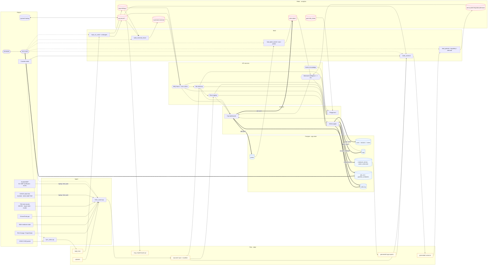
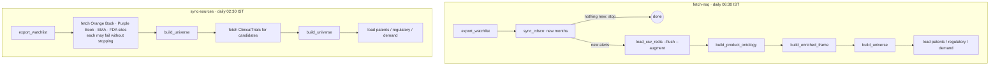

# Data map

This page covers where every dataset comes from, where it lives, what changes it, and which screens read it.

The same graph is live in the app at **Platform → Data map** (`/admin/data-map`):
- click a box to trace it upstream and downstream;
- the **Mutations** tab lists every write path;
- the **Stores** tab shows live row and key counts.

The graph is defined once in `backend/app/datamap.py`. Update that file (and this page) when a job, store or screen changes; `datamap.validate()` is run by the tests.

## 1. The whole flow



In the diagram, `-->` means data is read, `==>` means a write (mutation) and `-.->` means a job is started.

**Rule of thumb:**
- **Postgres** holds what people do in the app: accounts, organisations, plants, molecule edits, jobs, audit. It is durable (Neon).
- **Redis** holds the analytics data. It can always be rebuilt from the files and jobs.
- **Files** under `data/` are the ingest trail: raw downloads, normalised sources, the cumulative CSV, generated outputs and the snapshot.

## 2. Daily pipelines



Other jobs are on the Data jobs and Data pipelines pages:
- `build-universe`
- `src-*`, one per source
- `build-frame`
- `snapshot` and `restore-snapshot`
- `pull-upstash` and `backup-to-upstash`
- `load-seeds` and `sync-plants`

Orange Book and Purple Book are fetched at most weekly. DECRS is fetched at most every 3 days.

## 3. Stores

### Redis

| Key pattern | Type | Holds | Written by | Read by |
|---|---|---|---|---|
| `nsq:records`, `nsq:record:<id>`, `nsq:prediction:<id>`, `nsq:by_month:*`, `nsq:meta` | set / hash | One hash per CDSCO alert, plus manufacturer augmentation | `load_csv_redis` (fetch-nsq, refresh-nsq), `restore_snapshot`, `pull_upstash` | build_enriched_frame, build_universe (alert counts), frame fallback, snapshot, data status |
| `nsq:ontology:companies`, `nsq:ontology:products` (+`:meta`) | hash of JSON | Canonical manufacturer and product names | `load_csv_redis`, `build_product_ontology`; **also the API** when it has to rebuild the frame | build_enriched_frame, the frame fallback |
| `nsq:frame:enriched` (+`:meta`) | gzip+base64 parquet | The analytics table every NSQ chart uses | `build_enriched_frame` | API frame (preferred source) |
| `geo:india_states` (+`:meta`) | gzip+base64 GeoJSON | State boundaries | `load_geojson_redis` (manual) | Playground map |
| `cdmo:patent:<m>`, `cdmo:regulatory:<m>`, `cdmo:demand:<m>` | hash | Molecule intelligence with provenance | `load_patents` / `load_regulatory` / `load_demand` (flush and reload after every universe build), `pull_upstash` | Every opportunity, workbench, insights and world view |
| `cdmo:plant:<id>` | hash | Plant capabilities used for matching | `load_plant_assets`, `sync-plants`; **the API** when a plant is added or edited, and on start-up if a user plant is missing | Infrastructure, matching, workbench |

### Postgres

| Table | Holds | Written by | Read by |
|---|---|---|---|
| `users`, `sessions`, `invites` | Accounts, sessions, invites | Sign-in, account page, Users & team; the super admin is seeded on API start | Every request (session check), Users, Admin overview |
| `orgs` | Organisations, their NSQ manufacturer keys and plant ids | Organisations page; adding a plant attaches its id | All org dashboards, workbench (your plants) |
| `plants` | Durable copy of plants made in the app | Infrastructure (org admin), Site directory "add as plant" | sync-plants, API start-up restore |
| `molecule_entries`, `watch_molecules` | Typed molecule values and watchlist | Molecule universe (**super admin only**) | export_watchlist → build_universe |
| `job_runs`, `pipeline_schedules` | Runs, logs, schedules | Job runner, scheduler, Data pipelines | Data jobs, Data pipelines, Admin overview |
| `audit_log` | Every sign-in and change | Every mutating API call | Audit log, Admin overview |

### Files (`data/`)

| Path | Written by | Read by |
|---|---|---|
| `CDSCO … NSQ ….csv` | `sync_cdsco` (append) | `load_csv_redis`, `build_product_ontology` |
| `raw/<source>/*` | every fetcher (plus HTTP cache) | the fetcher's next run |
| `sources/<source>.json`, `sources/manifest.json` | `fetch_source`, `sync_cdsco` (manifest) | build_universe, site directory, pipelines page, molecule lookup |
| `sources/cdsco_plants.json` (+ `.csv`) | `fetch_source cdsco_plants` (`just fetch-plants`, job src-cdsco-plants / plant-registry) | plant registry (Plants tab, site directory match, Infrastructure "Match with CDSCO registry", "Add as plant") |
| `sources/eudragmdp.json` | `fetch_source eudragmdp` (`just fetch-eudragmdp`, job src-eudragmdp / plant-registry) | plant registry (EU GMP status, stated capabilities, non-compliance findings) |
| `raw/cdsco_plants/*` | SUGAM pages + WHO-GMP PDF from the last crawl | the next `cdsco_plants` run when CDSCO is unreachable |
| `uploads/*` | Data jobs → Upload | `--from-file` fetches, refresh-nsq |
| `*_seed.json` | hand-edited | build_universe, load-seeds, molecule lookup |
| `generated/watchlist.json`, `molecules.json` | `export_watchlist` (from Postgres) | build_universe |
| `generated/patents.json`, `regulatory.json`, `demand.json`, `molecule_universe.json`, `candidates.json` | build_universe | load_* scripts, Molecule universe page, ClinicalTrials fetch |
| `nsq_snapshot.json.gz` | `snapshot` job | frame fallback, restore-snapshot |

## 4. Every mutation, by trigger

| Trigger | What changes |
|---|---|
| **Scheduler** (every 30 s) | `pipeline_schedules` (fire times). It starts jobs, and each job writes `job_runs` plus the stores below. |
| **fetch-nsq** | CSV, `raw/cdsco`, manifest. When there are new alerts it also writes all `nsq:*` keys (flush and reload), the frame, `generated/*` and `cdmo:patent/regulatory/demand` (flush and reload). |
| **sync-sources / src-\*** | `raw/*`, `sources/*.json`, manifest, `generated/*`, `cdmo:patent/regulatory/demand` |
| **plant-registry / src-cdsco-plants / src-eudragmdp** (or `just fetch-plant-registry` + `just push-plant-registry`) | `raw/cdsco_plants/*`, `sources/cdsco_plants.json`, `sources/eudragmdp.json`, manifest. Nothing in Redis: the API re-reads the files when they change. |
| **Match with CDSCO registry** (Infrastructure) | `plants`, `cdmo:plant:*` (capabilities, basis, certificates, `reference.registry`), `audit_log` |
| **build-universe** (also run after saving a molecule) | `generated/*`, `cdmo:patent/regulatory/demand` |
| **load-seeds / sync-plants** | `cdmo:plant:*` (upsert) and the molecule stores |
| **snapshot / restore-snapshot** | the snapshot file, or `nsq:*` and `geo:*` |
| **pull-upstash / backup-to-upstash** | local `nsq:*`, `geo:*`, `cdmo:*`, or Upstash |
| **Sign in / account** | `sessions`, `users`, `audit_log` |
| **Users & team** | `users`, `invites`, `sessions`, `audit_log` |
| **Organisations** | `orgs`, `audit_log` |
| **Infrastructure / Site directory** | `plants`, `cdmo:plant:*`, `orgs.plant_ids`, `audit_log` |
| **Molecule universe** (super admin) | `molecule_entries`, `watch_molecules`, `audit_log`; then starts build-universe |
| **Data jobs / pipelines** | `job_runs`, `pipeline_schedules`, `uploads/`, `audit_log` |
| **API start** | seeds or repairs the super admin; marks interrupted runs failed; restores missing user plants to Redis |
| **API frame rebuild** (only when the precomputed frame is missing or stale) | `nsq:ontology:products` |

## 5. Which screen reads what

| Screen | Services | Underlying stores |
|---|---|---|
| Playground · Explorer & Ledger | NSQ frame | `nsq:frame:enriched`, `geo:india_states` |
| Playground · Insights | NSQ frame, molecule intelligence, site directory | frame, `cdmo:*`, `sources/fda_*.json` |
| Playground · Regulation map | molecule intelligence, built-in knowledge (`core/regulatory_regions.py`) | `cdmo:*` |
| Playground · Molecule workbench | molecule intelligence, NSQ frame, built-in knowledge, plant registry ("Who can make it") | `cdmo:*`, frame, `orgs` (your plants), `sources/cdsco_plants.json`, `sources/eudragmdp.json` |
| Playground · Process lab | built-in knowledge (`core/process_models.py`) | none |
| Playground · Plants | plant registry (CDSCO WHO-GMP + SUGAM + EudraGMDP), site directory | `sources/cdsco_plants.json`, `sources/eudragmdp.json`, frame |
| Org · Overview / Opportunities / EU export | NSQ frame, molecule intelligence | frame, `cdmo:*`, `orgs` |
| Org · Quality | NSQ frame (your manufacturer keys and national) | frame, `orgs` |
| Org · Infrastructure | molecule intelligence (plants), site directory, plant registry | `cdmo:plant:*`, `plants`, `sources/fda_*.json`, `sources/cdsco_plants.json`, `sources/eudragmdp.json` |
| Admin overview | NSQ frame, data status | frame, `nsq:meta`, snapshot, `job_runs`, `audit_log`, `users` |
| All-India NSQ | NSQ frame | frame |
| Organisations | NSQ frame (manufacturer search), plants | `orgs`, frame, `cdmo:plant:*` |
| Data pipelines | universe & source status | manifest, `generated/molecule_universe.json`, `pipeline_schedules`, `job_runs` |
| Molecule universe | universe, molecule intelligence, lookup | `generated/*`, `cdmo:*`, seeds, `sources/*`, `molecule_entries`, `watch_molecules` |
| Site directory | site directory, plant registry | frame, `sources/fda_*.json`, `sources/cdsco_plants.json`, `sources/eudragmdp.json`, `orgs` |
| Audit log | none | `audit_log` |

## 6. Things worth knowing

- **Spurious batches.** A batch declared spurious is listed under the company printed on its label, which may not be the real maker. The API flags these rows (`_spurious`) and keeps them out of every company ranking, the site directory and org ranks. They appear in Insights and in the Ledger's Authenticity column.
- **Unused Redis keys.** `cdmo:complexity:*` and `cdmo:portfolio:*` have store functions but no writers today.
- **Legacy `/analytics` service.** It reads the same Redis keys through `analytics/shared/*`, which is a copy of `core/*`. It only starts with the `legacy` compose profile.

## Plant registry (CDSCO)

`redis-loader/sources/cdsco_plants.py` builds `data/sources/cdsco_plants.json` from two official CDSCO lists:
the WHO-GMP certified-units PDF (read by page layout: serial column, name/address, "category of drugs permitted")
and the SUGAM approved-manufacturing-site table (licence number, form, own/loan, loan licensee, dates). The free
text becomes a fixed vocabulary — dosage forms, sterile / API, segregated blocks (beta-lactam, cephalosporin,
hormone, cytotoxic…) scoped to the forms they cover, therapeutic classes — and every capability keeps the CDSCO
sentence it came from. The output also keeps the parsed inputs, so a run that cannot reach CDSCO rebuilds from them
instead of losing data. CDSCO refuses many cloud networks: run it on a machine in India or a laptop, or upload the PDF
to the "CDSCO plant registry" job.

`backend/app/plants.py` links NSQ directory sites to registry plants (company + PIN = `site`; same PIN, near-identical
name = `site_fuzzy`; company + town, or the company's only plant in the state = `company`) and serves `/api/plants*`:
per-capability denominators (plants that can make X, share with NSQ alerts), the plant list and plant detail.
"Add as plant" from the site directory adds the registry's forms as `stated` capabilities and the WHO-GMP certificate.

`core/capability_rules.py` turns a registry listing into capability-catalog tokens: `required` (Schedule M / WHO-GMP
require it for the products listed — e.g. Grade A cleanrooms and WFI for injectables, dedicated segregated areas for
beta-lactam or cytotoxic blocks, export barcoding for WHO-GMP units) or `inferred` (usual, not mandatory — e.g. film
coating for tablets), each with the rule text. It feeds the plant drawer's coverage view, "Add as plant", and
Infrastructure → "Match with CDSCO registry", which adds these tokens to an existing plant without downgrading anything
stated or entered.

`redis-loader/sources/eudragmdp.py` crawls EudraGMDP for every Indian GMP certificate and statement of non-compliance
(a Struts session: form POST search, `action=Page&param=N`, `action=Drilldown&param=<id>` only for rows on the current
page). Part 2 scope lines (Union coded format) become stated capabilities through `capability_rules.from_eu_scope`;
statements of non-compliance keep the inspectors' "nature of non-compliance". `plants.py` attaches each EU site to a
registry plant (company + PIN, or company + town) or adds it as an EU-only plant; the site's status is
non-compliant when its latest document is a statement of non-compliance.

### Running the plant registry

```bash
just setup                    # once: loader venv (includes pdfplumber)
just fetch-plant-registry     # CDSCO SUGAM + WHO-GMP PDF, then EudraGMDP — on a laptop
just push-plant-registry ec2-user@<server> ~/.ssh/<key>.pem   # copy to the server, restart the API
```

Admin → Data jobs has the same as **Rebuild plant registry** (both sources), **CDSCO plant registry** and
**EU GMP certificates** (each accepts an uploaded file when the server cannot reach the site).
